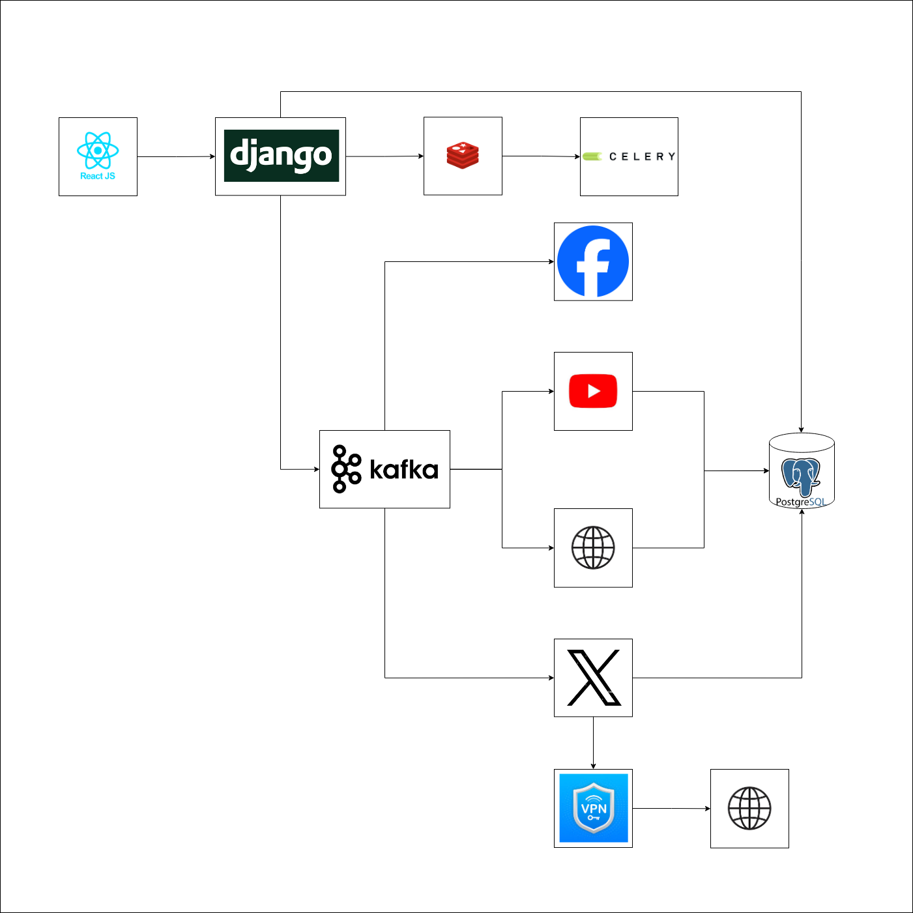

# FORSIGHT - Backend

FORSIGHT is a microservices-based application that crawls data from various social media platforms like Facebook, YouTube, Twitter, and predefined websites. It is designed for robust data processing, real-time analytics, and seamless data management.

## Table of Contents

- [Project Overview](#project-overview)
- [Tech Stack](#tech-stack)
- [Prerequisites](#prerequisites)
- [Installation](#installation)
- [Configuration](#configuration)
- [Kafka Topics](#kafka-topics)
- [Running Services](#running-services)
- [License](#license)
- [Contact](#contact)
    "password":"12345" 
}
## Project Overview

FORSIGHT is built with a microservices architecture to efficiently handle the crawling of data from multiple sources. The project is designed to be scalable, modular, and capable of processing large amounts of data in real-time.

## Architecture Diagram



## Tech Stack

- **Backend:** Django, Django Rest Framework
- **Microservices:** Kafka, Celery, Celery Beat
- **Message Broker:** Redis
- **Database:** PostgreSQL
- **Streaming Platform:** Kafka
- **Frontend:** React
- **Others:** JWT authetication
## Prerequisites

- Python
- Django
- PostgreSQL
- Redis
- Kafka
-Pgbouncer
## Installation

1. Clone the repository:

    ```bash
    git clone git@github.com:FORSIGHT-FORBMAX/Forsight-backend.git
    cd forsight
    ```

2. Install Python dependencies:

    ```bash
    pip install -r requirements.txt
    ```

3. Set up PostgreSQL,Pgbouncer, Redis, and Kafka on your local machine or server.

4. Run database migrations:

    ```bash
    python manage.py makemigrations
    python manage.py migrate
    ```

## Configuration

### 1. Django Settings

Update the `settings.py` file with the following configurations:

### ALLOWED_HOSTS
```python
ALLOWED_HOSTS = ['add only the ip of your machine where backend server will be running']
```
```python
avoid ALLOWED_HOSTS = [*]
```
```python
DEBUG = False
```
```python
CORS_ALLOWED_ORIGINS = [
    "http://*.*.*.*:port",
    ]
    
CSRF_TRUSTED_ORIGINS = [
    "http://*.*.*.*:port",
    ]

dont add * alwas mention the ip and port of frontend server
```


#### Celery & Redis

```python
CELERY_BROKER_URL = 'redis://yourIP:yourPort/0'
CELERY_RESULT_BACKEND = 'redis://yourIP:yourPort/0'
```

#### Kafka

```python
KAFKA_BROKER_URL = 'yourIP:yourPort'
```

#### PostgreSQL (DEV)

```python
DATABASES = {
    'default': {
        'ENGINE': 'django.db.backends.postgresql',
        'NAME': 'your_db_name',
        'USER': 'your_db_user',
        'PASSWORD': 'your_db_password',
        'HOST': 'yourIP',
        'PORT': 'yourPort',
    }
}
```
#### PostgreSQL (STAGE/UAT/PRODUCTION)

```python
DATABASES = {
    'default': {
        'ENGINE': 'django.db.backends.postgresql',
        'NAME': 'your_db_name',
        'USER': 'your_db_user',
        'PASSWORD': 'your_db_password',
        'HOST': 'pgbouncer_host',  # This should point to PgBouncer
        'PORT': 'pgbouncer_port',  # This should be the port PgBouncer is listening on
    }
}
```

#### PgBouncer
In your PgBouncer configuration, you will set up the connection pooling. Here is an example of what you might include in your pgbouncer.ini
```python
[databases]
your_db_name = host=postgres_host port=postgres_port dbname=your_db_name

[pgbouncer]
listen_addr = 0.0.0.0
listen_port = 6432
auth_type = md5
auth_file = /etc/pgbouncer/userlist.txt
pool_mode = session
max_client_conn = 100
default_pool_size = 20

```
You will also need a userlist.txt file for PgBouncer authentication:
```python
"your_db_user" "md5your_db_password_hash"
```

### 2. Kafka Topics

Before starting the application, create the necessary Kafka topics:

```bash
kafka-topics.sh --create --topic twitter_profile_base_topic --bootstrap-server 192.168.11.60:9092
kafka-topics.sh --create --topic twitter_keyword_base_topic --bootstrap-server 192.168.11.60:9092
kafka-topics.sh --create --topic recrawl_twitter_profile_base_topic --bootstrap-server 192.168.11.60:9092
kafka-topics.sh --create --topic recrawl_twitter_keyword_base_topic --bootstrap-server 192.168.11.60:9092
kafka-topics.sh --create --topic youtube_keyword_base_topic --bootstrap-server 192.168.11.60:9092
kafka-topics.sh --create --topic youtube_profile_base_topic --bootstrap-server 192.168.11.60:9092
kafka-topics.sh --create --topic web_keyword_base_topic --bootstrap-server 192.168.11.60:9092
kafka-topics.sh --create --topic web_profile_base_topic --bootstrap-server 192.168.11.60:9092

```
## Initializing the application for first time 
Before starting the application, create the dependency folders:
actiavte your venv

```bash
python manage.py initialize
```
## mount the NFS on folder FORSIGHT-BACKEND/media
cotact walled for this step he will guide you


## Running Services

### 1. Start Django Server

To run the Django development server, use:

```bash
gunicorn --workers 17 --bind 192.168.11.60:8001 --access-logfile ./access.log --error-logfile ./error.log forsight.wsgi:application
```

### 2. Start Celery Worker

Run the Celery worker:

```bash
celery -A forsight.celery worker --pool=processes -l info
```
#https://news.sky.com/                #Working
#https://www.aljazeera.com/           #Working
#https://www.nation.com.pk/           #Working
#https://www.pakistantoday.com.pk/    #working

### 3. Start Celery Beat

Run Celery Beat to schedule periodic tasks:

```bash
celery -A forsight.celery beat -l info
```

## License

This project is not licensed.

## Contact

test - staging-main alerts #3

For any queries or issues, please contact Jawad Khan at jawad@forbmax.ai
